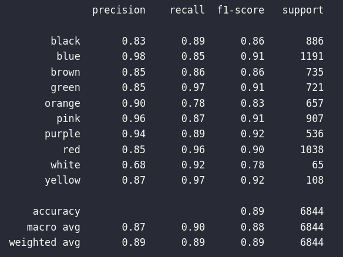

# Build model CNN for Detection Color Car

## 1. Architecture
[Link paper](https://arxiv.org/pdf/1510.07391.pdf) 

## 3. Build model 
- Implementation paper with pytorch
- Custorm with metrics F1-score, Early Stopping, Scheduler learning rate.
- You can try with mobinet or resnet18. But it using pretrain not neccessary for simple classification.
## 2. Evaluation

- Confusion Matrix of Train dataset
 
- confusion matrix of Test dataset
 

## 3. Prediction
 
- Inference Time: 0.028s